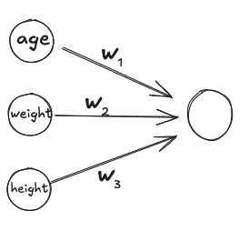

The aim of this post is to walk through a toy example of machine learning, without the complications of neural networks.

Prerequisites:
- [What is a function?](../what-is-a-function)

Contents:
- The high-level steps
- The toy example
- What about neural networks?
- Remarks on the terms 'learning' and 'training'
- Questions for understanding
- Miscellaneous details

## The high-level steps

Do not expect to understand these steps right away. They will be clearer after the toy example.

Set-up:

- Determine what the machine is trying to learn
- Get ground-truth data in a table
- Choose a group of functions that the machine will use to model the data
- Choose initial values for the parameters of the function

Training or learning:

Repeat the following steps until some criteria is met.

- Use current parameters to make predictions
- Calculate the loss, a numerical value to measure how good the predictions are compared to the ground-truth
- Using the loss, make a small adjustment to the parameters that will hopefully improve the loss.
How this adjustment is done is too much for this post, but a common tool is 'gradient descent'.

## The toy example: predicting whether somebody is healthy

### Determine what the machine is trying to learn

For the toy example, the machine will try to learn whether a person is healthy based on a person's age, weight and height.

### Get ground-truth data

The ground-truth data is a table of people's age, weight and height, and whether they are healthy.
For example, the first few rows might be:

| Age    | Weight (kg) | Height (m) | Healthy |
|--------|---------|---------|---------|
| 23     | 72      | 1.65     | Yes     |
| 47     | 43      | 1.88     | No      |
| 31     | 75      | 1.72     | Yes     |
| 52     | 121     | 1.81     | No      |

### Choose a group of functions

We choose the class of functions from the [prerequisite post](../what-is-a-function):

$f(\text{age}, \text{weight}, \text{height}) = w_1 \text{age} + w_2 \text{weight} + w_3 \text{height}$.

Important notes:
- We can now say precisely what the machine is trying to learn.
It is trying to learn the weights $w_1, w_2, w_3$ so that the function will correctly output $1$ (for healthy) or $0$ (for unhealthy).
- Implicit in these steps is that everything should be made numerical.
In this example it was straightforward, but often this is tricky, e.g. how do you convert words and sentences into numbers?

### Orbit review


In this toy example, what *precisely* is the machine trying to learn?
The weights $w_1, w_2, w_3$ so that the function will correctly output $1$ (for healthy) or $0$ (for unhealthy).

The top row of the table is Age 23, Weight 72, Height 1.65, Healthy Yes. What is the ideal value of $f(23, 72, 1.65)$?
1

What is implicit in the setup steps?
Everything should be made numerical.


### Choose initial values for the parameters

Just choose some random starting values.
For example, we might choose $w_1 = 3, w_2 = 1, w_3 = 4$.

### Make predictions using current parameters

| Age | Weight | Height | Healthy | Prediction |
|-----|--------|--------|---------|------------|
| 23  | 72     | 165    | 1       | 894        |
| 47  | 43     | 188    | 0       | 1081       |
| 31  | 75     | 172    | 1       | 953        |
| 52  | 121    | 181    | 0       | 1061       |

(Question to check understanding: How did I get the numbers in the prediction column?)

We see that the predictions are terrible - the predicted values are nowhere near the ground truth values of 0 and 1.
This is normal since we started with random values for the parameters.

### Calculate the loss

There are many choices here, but a common one is the total squared error.
(You do not need to know why this is a common choice).
You find the difference between the prediction and the ground-truth, square it, and then add them all together.

For just these four rows, we would get:

$$(1 - 894)^2 + (0 - 1081)^2 + (1 - 953)^2 + (0 - 1061)^2 = 3998035$$

To get the total loss, we would sum this for *all* the rows.

### Improve the parameters based on the loss

As I said above, going into the details here is too much for this post.
But after repeating the above steps many times (make predictions, calculate loss, improve parameters), the machine will have learnt some weights that we hope do a good job of predicting the healthy value for each person.

### Orbit review

Which steps are repeated in the training loop?
Make predictions, calculate the loss, improve the parameters.

Qualitatively, what is the loss?
A numerical value to measure how good the predictions are compared to the ground-truth.

How are the initial parameters chosen?
Randomly.


## What about neural networks?

The steps are all exactly the same, except that instead of the simple function above with three parameters, we use a more complicated function (known as a neural network) which have many more parameters.

To learn about neural networks, [3Blue1Brown's resources](https://www.3blue1brown.com/lessons/neural-networks) are hard to beat (despite some details being out of date, e.g. neurons do not need to have values between 0 and 1).

## Remarks on the terms 'learning' and 'training'

We use the the terms 'learning' and 'training', but do not anthropomorphize the machine.
The machine is not pondering or making any decisions or reflecting on its mistakes, as you do.
This whole process is deterministic.
The rules and calculations are all known and if we repeated the whole process (using same choices, e.g. initial parameters) we would get the same result.

HOWEVER, it is feasible that future LLMs can actually do some kind of 'thinking' that strategically influences its own training.
This is one of my big uncertainties - how can some deterministic mathematical process be able to do something like this?
But we humans exist and we are some kind of physical machine that can do strategic thinking, so it must be possible for computers to do this.
However I cannot conceive how it would actually work in practice.

I suspect many people technical people are not worried about X-risk because they have internalized that everything is just numerical deterministic functions, and so dismiss the possibility of machines going rogue.

### Orbit review

What are the four steps in the set-up, before the training loop?
Determine what the machine is trying to learn, get ground-truth data, choose a group of functions that machine will use to model the data, choose initial values for the parameters.

During training, which of the following is being adjusted to improve the loss: the input data, the group of functions, and/or the parameters.
The parameters.

Which steps are changed when going from the simple function to a neural network?
Only the choice of the group of functions.

What can be misleading about the term 'learning'?
It is easy to anthropomorphize the machine and imagine it is thinking and pondering. The whole process is deterministic. But who knows if this will continue to be true for all future LLMs.


## Questions for understanding

- Before running the training, do we know what parameters we will end with?
  - If yes, how do we know? Furthermore, if we knew, why would we need to run the training?
  - If not, how this is possible? We know all the details of the process so how can we not know the result?

- Is it guaranteed that there even are good parameters to be learnt?

- Would changing the order of the rows in the ground-truth data change the result?

- In the toy example, the simple function is actually too simple and there are no good parameters. Think of some reasons why this is the case. To help, try thinking of parameters that will do a good job and hopefully you will find problems.

- In the example of image classification, how would you make this all numerical? For concreteness, suppose all the images are 1000x1000 pixels and we are trying to classify the image as one of 50 different animals.

## Miscellaneous details

- The task I have described above - learning a function to get from inputs to outputs using ground-truth data - is known as 'supervised learning', which is a sub-field of machine learning.
- Other people may break down the steps differently, but the main ideas should be the same.
- There are many options for the group of functions, not just neural networks or this simple function. Some others are 'decision trees', 'support vector machines' and 'general additive models'.
- There are alternatives ways to find good parameters, not just the iterative gradient-based process I described. (But the iterative process is the most common one for neural networks.) For example, decision trees use a 'greedy search algorithm' that is distinct from gradient descent.
- In practice, we do not calculate the loss on the whole dataset for each improvement step. Instead, we calculate the loss on a subset of the data and treat it as a good estimate for the true total loss. These subsets are called 'batches'.
- There are many details involved in most of these steps and a lot of ML research is about finding which variations of these steps work better in which situations.
  - How to choose good data? Should we augment the data (e.g. by rotating images)?
  - How to choose good groups of functions? E.g. within neural networks, there are many choices of architecture, e.g. the number of layers.
  - How to choose good initial parameters? Even though they are random, there are still heuristics for what kind of randomness is good.
  - How to decide when to stop training?
  - How to choose good loss functions?
  - And so on...

### Orbit review

What is supervised learning?
Supervised learning is a sub-field of machine learning where the machine is trying to learn a function to get from inputs to outputs using ground-truth data.

Is it guaranteed that there even are good parameters to be learnt?
No, it is not guaranteed. For example, the group of functions used in the toy example is too simple.

