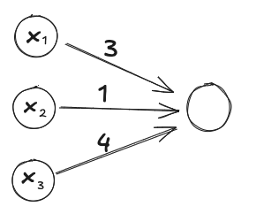

<!-- Functions are ubiquitous in machine learning.
You have loss functions, activation functions, and sigmoid functions.
Neural networks themselves are functions.
Gradient descent is all about trying to optimise some function - and gradient descent itself is a function.

There is nothing fundamentally complicated about them (except maybe that the word has no relation to day-to-day usage of the word 'function'), but the term is used by most technical people without realising they take it for granted.
A notable example is that 3Blue1Brown's videos all assume that you know what a function is. -->

This post uses (an early version of) the [Orbit](https://withorbit.com/) system developed by Andy Matuschak.

- **Definition**
  - A function is just a way of assigning exactly one output to each of its possible inputs.
- **Notation**
  - If $f$ is a function and $x$ is a possible input, then the output of $f$ when the input is $x$ is written $f(x)$.
  - Often this is read as 'f of x'.
  - A common mistake is to read this as 'f multipled with x'! Brackets do sometimes mean multiplication, but not in this context.

- **Examples**
  - $f$ is the function that adds 7 to its input. So for example, $f(3) = 10$.
  - $g$ is the function that outputs 1 if the sum of the first two inputs is greater than third input, and 0 otherwise. So for example, $g(5, 7, 10) = 1$ and $g(5, 7, 20) = 0$.
  - $b$ is the function that has inputs somebody's weight and height, and outputs their body mass index.


True or false? If $t$ is a function, then $t(a)$ is the output of $t$ when the input is $a$.
True

True or false? If $t$ is a function, then $t(a)$ is often read as 't of a'?
True

True or false? If $t$ is a function, then $t(a)$ is $t$ multiplied by $a$?
False


## An important group of functions

I won't explain why these are important, but they occur in all numerical fields, e.g. economics or engineering or machine learning.
In particular, they occur in neural networks.
I will illustrate with an example.

**Example**
- $f$ has three inputs $x_1, x_2, x_3$, multiplies them by $3, 1, 4$ respectively, and adds them together.
- So $f(1, 2, 3) = (3 \times 1) + (1 \times 2) + (4 \times 3) = 17$.

In the context of machine learning, the numbers $3, 1, 4$ are called the weights or parameters of the function.

Also in the context of neural networks, this calculation is represented in the following diagram:

For a generic input, the function would be drawn as:

As you can see, this diagram is already a bit messy.
Imagine if we had more inputs, or, we added more layers on the end!
Hence, the convention is to just hide the output with the understanding we multiply each input with the corresponding weight, and then add them all together.

In context of neural networks, the circles and the numbers inside them are called neurons or nodes.


In the diagram, what is the name of numbers above the arrows?
The weights or parameters.

In the diagram, what is the name of the circles?
Nodes or neurons.

In the diagram, how do you calculate the output from the inputs and the weights?
Multiply each input with the corresponding weight, and then add them all together.


Disclaimer: There are actually two little extra bits going on in a neural network in these diagrams.
First is 'bias' and second is an 'activation function'.
I will not explain them here as they are explained in 3Blue1Brown's video on neural networks.
The aim of this post is to explain what a function is and explain one particular function.