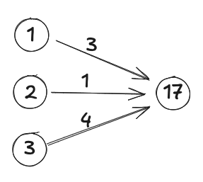
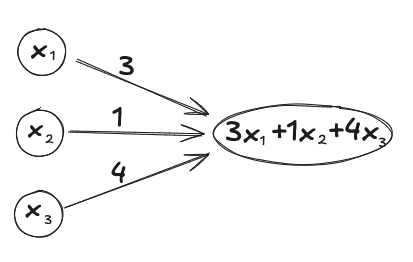
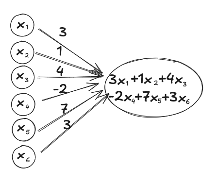
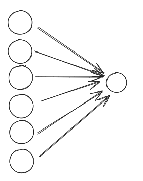

<!-- Functions are ubiquitous in machine learning.
You have loss functions, activation functions, and sigmoid functions.
Neural networks themselves are functions.
Gradient descent is all about trying to optimise some function - and gradient descent itself is a function.

There is nothing fundamentally complicated about them (except maybe that the word has no relation to day-to-day usage of the word 'function'), but the term is used by most technical people without realising they take it for granted.
A notable example is that 3Blue1Brown's videos all assume that you know what a function is. -->

<!-- This post uses (an early version of) the [Orbit](https://withorbit.com/) system developed by Andy Matuschak. -->

The aim of this post is to introduce the notion of a function and explain an important group of functions.

Pre-requisites
- [What is orbit?](../what-is-orbit)

Contents
- Definition
- Notation
- Examples
- Orbit review
- An important group of functions
- Orbit review
- Why are they called 'weights'?
- Details

## Definition
- A function is just a way of assigning exactly one output to each of its possible inputs.

## Notation
- If $f$ is a function and $x$ is a possible input, then the output of $f$ when the input is $x$ is written $f(x)$.
- Often this is read as 'f of x'.
- A common mistake is to read this as 'f multipled with x'! Brackets do sometimes mean multiplication, but not in this context.

## Examples
- $f$ is the function that adds 7 to its input.
  - For example, $f(2) = 2 + 7 = 9$.

- $g$ is the function that outputs 1 if the sum of the first two inputs is greater than third input, and 0 otherwise.
  - For example, $g(5, 7, 10) = 1$ and $g(5, 7, 20) = 0$.

- $b$ is the function whose inputs are somebody's weight (kg) and height (m), and outputs their body mass index.
  - For example, $b(70, 1.7) = 24.2$.

## Orbit review

True or false? If $t$ is a function, then $t(a)$ is the output of $t$ when the input is $a$.
True

True or false? If $t$ is a function, then $t(a)$ is often read as 't of a'?
True

True or false? If $t$ is a function, then $t(a)$ is $t$ multiplied by $a$?
False


## An important group of functions

I won't explain why these are important, but they occur in all numerical fields, e.g. economics or engineering or machine learning.
In particular, they occur in neural networks.
I will illustrate with an example.

### Example
- $f$ has three inputs $x_1, x_2, x_3$, multiplies them by $3, 1, 4$ respectively, and adds them together.
- So $f(1, 2, 3) = (1 \times 3) + (2 \times 1) + (3 \times 4) = 17$.

In the context of machine learning, the numbers $3, 1, 4$ are called the weights or parameters of the function.

Also in the context of neural networks, this calculation is represented in the following diagram:

In the context of neural networks, the circles and the numbers inside them are called neurons or nodes.
For example, you could say 'In this example, the value of the 2nd input node is 2' or you could ask 'What inputs would make the output node equal to 20?'

For a generic input, the function would be drawn as:

With only 3 inputs, the diagram is not too bad. But with more inputs things get messy. Here is six inputs:

Hence, the convention is to just hide all the numbers and variables, with the understanding that the values in the input nodes are multiplied by their corresponding weight, added together, and this gives value of the output node.

## Orbit Review


In the diagram, what is the name of numbers above the arrows?
The weights or parameters.

In the diagram, what is the name of the circles?
Nodes or neurons.

In the diagram, how do you calculate the output from the inputs and the weights?
Multiply each input with the corresponding weight, and then add them all together.


## Why are they called 'weights'?

This is one of those times where the name actually makes sense: we call them weights because they tell you how much weight is put on each input.

In our example, the weights are $3, 1, 4$, which means that the 3rd input has four times the weight of the 2nd input.

Minor details on weights:
- The weights do not need to be nice round numbers, they can be any number: fractions, decimals, huge, negative, zero, etc.
- 'Parameters' is the more general term for numbers that are used to define a function. Weights are a particular kind of parameter, which tell you how much weight is put on different inputs. In neural networks, another kind of parameter is 'biases'.

## Details

I have simplified the meaning of the diagrams, as the main intention was to explain functions.
There are actually two little extra bits going on in a neural network in these diagrams.

- 'bias'
- 'activation function'

I will not explain them here as they are explained in [3Blue1Brown's resources](https://www.3blue1brown.com/lessons/neural-networks) on neural networks.