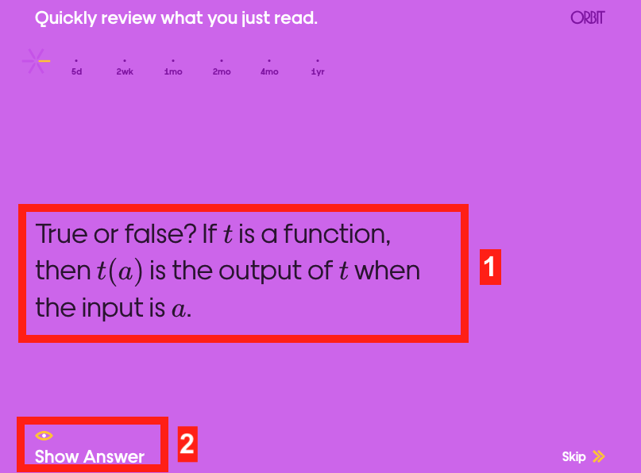
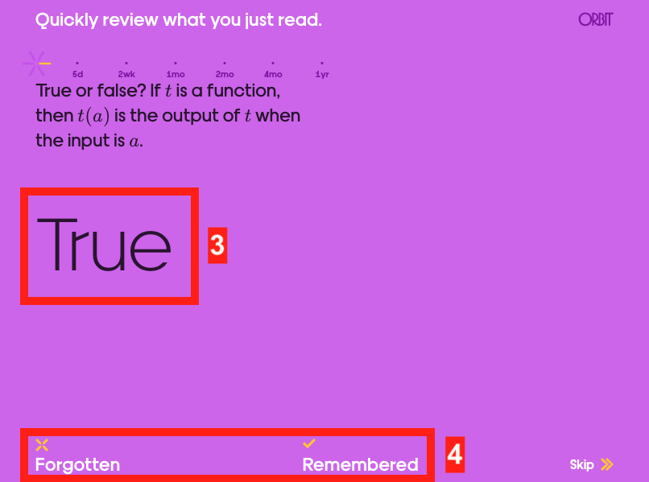
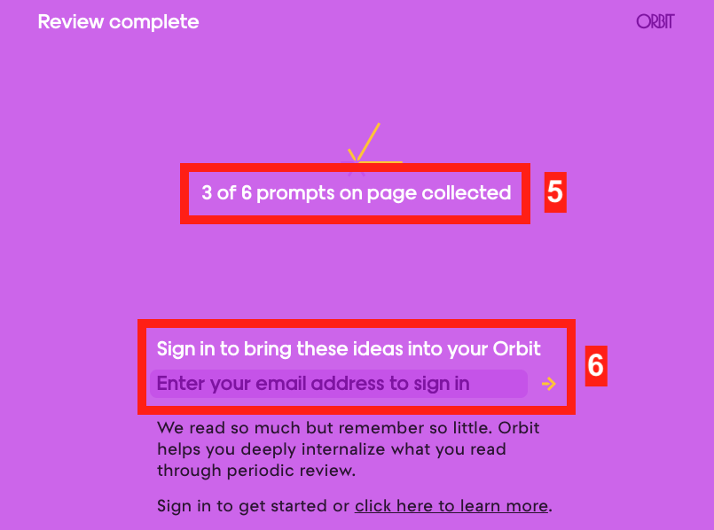

The aim is to explain the Orbit system that I use in my resources.

Pre-requisites
- None

Contents
- What is orbit
- Example of an orbit review
- Further reading

## What is orbit

Orbit is a system, developed by Andy Matuschak, to increase the engagement and learning of articles.
This is done via Orbit Reviews throughout the article, which ask the user questions about what they have just read.

A real example is given at the end of this article, but first here are screenshots from the first orbit review from the [What is a function?](../what-is-a-function).

1. You will be given a question. You should think of the answer for yourself.
2. Once you have thought of your answer, you click on Show Answer.

3. The answer will be shown.
4. You decide if you correctly remembered the answer or not. If you select Remember, you will not be shown the question again. If you select Forgotten, you will be shown the question again, to help you remember.

5. Once you complete the questions in that block, you will be told how many questions from the whole page have been done.
6. If you want to learn the content in the long-term, you can create an Orbit account, and you will be given a daily quiz using the questions from all the Orbit questions you have done.
The more comfortable you are with a question, the less frequently you will be shown that question.

## An example of an Orbit review

Should you click on 'Show Answer' before or after you have thought of the answer for yourself?
After

True or false. The system automatically determines if you remembered or forgot the answer.
False

Why are you asked for your email when you complete all the questions?
If you want to learn the content in the long-term, you can create an Orbit account and get a daily quiz on your Orbit questions.


## Further reading
See the official page for [Orbit](https://withorbit.com/) for more information and further reading.